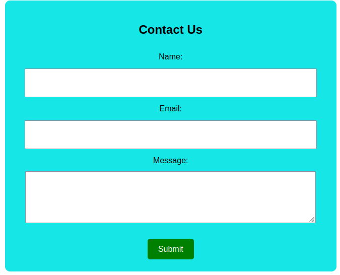

# 🌐 Contact Form

This project features a simple, responsive **Contact Form** built with HTML and styled using vanilla CSS. The form includes input fields for **Name**, **Email**, and a **Message textarea**, with a centered submit button.

---
## 🖼️ Preview



## 📁 Project Structure

```
/project-directory
├── index.html
├── styles.css
└── images/
    └── preview.png
```
## 🧱 HTML Overview (`index.html`)

- Semantic and accessible form structure.
- All input fields are labeled and required.
- Textarea used for message input.
- Submit button is centered and styled.

## 🎨 CSS Overview (styles.css)
- Responsive container with border radius and padding.

- Block-styled, centered form elements.

- Button with hover effects.

- Clean, modern font and color palette.

## 📌 Notes & Suggestions
- ✅ Validation: All fields are required using the required attribute.

- ⚠️ Improvement Suggestion: Avoid using the same id for both label and input. Only the input should have a unique id, and labels should use the for attribute to link.

- 📱 Consider adding max-width and @media queries for better responsiveness on mobile devices.

## 📷 Preview
- A clean, centered contact form with bright colors and smooth interactions.
